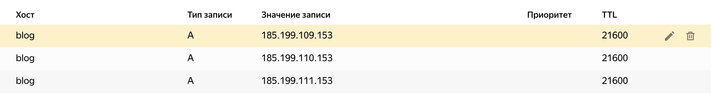
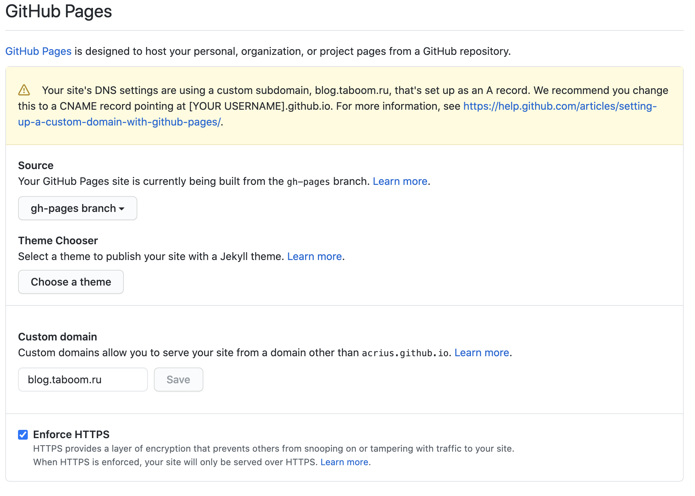

Вот мы создали свой сайт и разместили его на Github Pages. Мы можем переходить на него через домен github.io.
Но мы же хотим, что бы наш сайт был на нашем домене? Да сто пудов😉.

На самом деле, всё очень просто. Нужно выполнить 2 шага:

1. У Вашего днс провайдера необходимо добавить A записи на сервера github:
   1. 185.199.109.153
   2. 185.199.110.153
   3. 185.199.110.153
К примеру, в яндекс днс это выглядит примерно так:


2. Теперь нужно сказать github, что бы по нашему домену нужно показывать наш сайт.
Для этого зайдем в настройки Settings, Options, в раздел GitHub Pages и заполним поле ```Custom domain```.



Так же можно включить флаг ```Enforce HTTPS```, чтобы доступ к Вашему сайту был https. Но сертификат может сгенерироваться не сразу.

Вот и всё😋!
