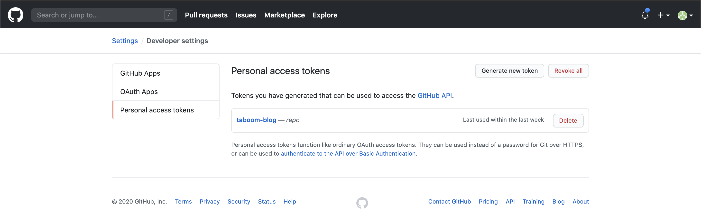
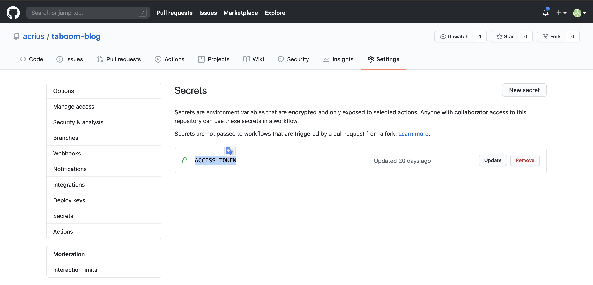

Вот мы создали свой блог на Gatsby и даже написали свою первую статью. Но на этом ведь ещё не всё? Мы же хотим выставить его наружу и похвастаться? Да ещё, чтобы и на халяву было.😜

Тут у нас есть множество вариантов, о которых можно почитать в [документации](https://www.gatsbyjs.org/docs/deploying-and-hosting/).
Но, а я решил взять привычный для меня вариант - Github Pages. И расскажу о нем.

С недавних пор у github есть свой удобный инструмент для автоматического деплоя(Халявный, как мы любим☺️) - Github Actions.
А самое главное - для них есть [магазин](https://github.com/marketplace?type=actions).
Набираем ```Gatsby``` и видим прекрасный Github Action - [Gatsby Publish](ttps://github.com/marketplace/actions/gatsby-publish).

Он то нам и нужен.

Теперь нам нужно получить ключ доступа для нашего репозитория. Сделать это довольно просто - заходим в Settings, далее Developer Settings, Personal access token и создаём токен для нашего репозитория.



Передаем на токен в секретные переменные деплоя. Сделать это просто, в настройках репозитория Settings, Secrets. Создаем переменную ```ACCESS_TOKEN```, содержащую наш токен.



Теперь нам нужно создать файл с инструкциями деплоя ```.github/workflows/deploy.yml```:

```yaml
name: Deploy

on:
  push:
    branches:
      - master

jobs:
  build:
    runs-on: ubuntu-latest
    steps:
      - uses: actions/checkout@v1
      - uses: enriikke/gatsby-gh-pages-action@v2
        with:
          access-token: ${{ secrets.ACCESS_TOKEN }}
          deploy-branch: gh-pages
```

О том, как писать Github Actions можно прочитать в [документации](https://help.github.com/en/actions).
Но давайте вкратце разберёмся, что же у нас тут происходит.

```yaml
on:
  push:
    branches:
      - master
```

Если перевести на русский, то здесь сказано, что наш деплой будет происходить только при изменениях в ветке ```master```.

```yaml
jobs:
  build:
    runs-on: ubuntu-latest
    steps:
      - uses: actions/checkout@v1
      - uses: enriikke/gatsby-gh-pages-action@v2
        with:
          access-token: ${{ secrets.ACCESS_TOKEN }}
          deploy-branch: gh-pages
```

Тут мы говорим, что будем основываться на образе Ubuntu и используем нужный нам [Gatsby Publish](ttps://github.com/marketplace/actions/gatsby-publish). Указываем ему переменные ```access-token``` для доступа к нашему репозиторию, и ```deploy-branch``` - ветку, в которую будет помещаться сборка нашего блога.

Ну вот и всё. Пушим в мастер и переходим на страницу ```http://{Ваш ник}.github.io/{Ваш репозиторий}```.
Если всё сделано правильно, то мы увидим наш сайт.
